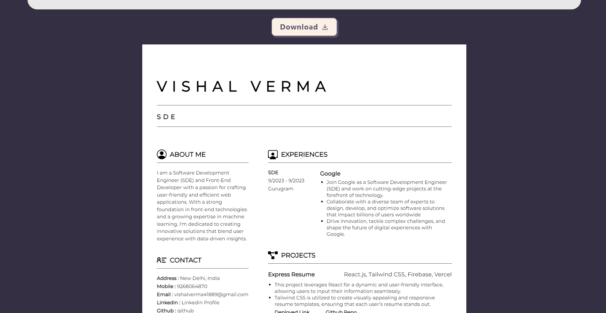
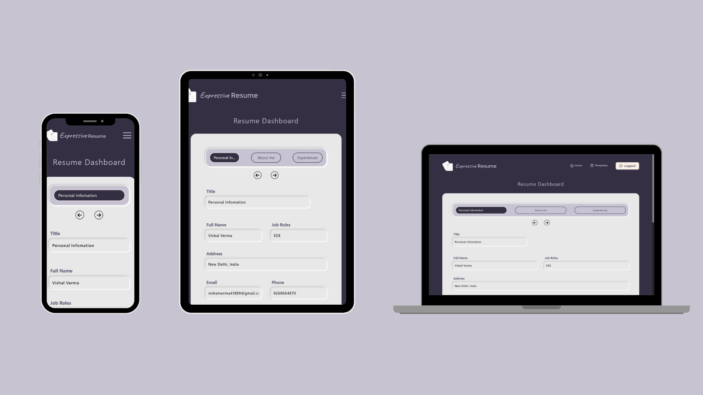

#  Express Resume

The `Express Resume` is a web application that allows you to  generate customized Resume in few minutes on your requirements. It also has ability to build, print, and download your resume in minutes. It is built using the React JavaScript library and offers a range of features to customize and generate resumes efficiently.

## 📸Preview

  </img>

## ✨Features

- `Google Account Authentication`: Firebase provides a seamless and secure authentication system for Google accounts, simplifying user sign-ins in web apps.
- 
</img>

- `Live Resume Preview`:  A live preview feature enables users to see their resume changes in real-time as they make modifications.
- `Support Download Functionality`: Once the resume is complete, users can export it as a PDF or download it as a file.

- 
</img>

- `Editable Sections`: Users can easily edit and rearrange different sections of their resume, such as personal information, education, work experience, projects, and more.
- `Responsiveness`: The Express Resume is designed to be responsive and mobile-friendly.
- 
</img>

- `User Feedback/Queries`: Users can send their feedback, questions, or queries through a `contact form`, enabling direct communication with the administrators.

## 🤖Technologies Used

The `Express Resume` is built using the following technologies:

- `React.js`: A JavaScript library for building user interfaces.
  Used React features likes states, contexts etc.
- `Tailwind CSS`: A utility-first CSS framework that streamlines web development by providing a set of pre-designed utility classes for rapid and customizable styling.
- `React-To-Print`: Library for printing React components.
- `Vercel`: Platform for deploying React applications.
- `React-icons`: React's own Icon library for adding icons to the user interface.
- `Firebase Google Authentication`: Firebase's Google Authentication offers a seamless and secure way to enable user sign-ins via Google accounts in your applications.
- `React Router`: A library for handling routing in a React application.

## ✨Prerequisites
Before getting started, make sure you have the following prerequisites installed:

- `Firebase`: Create a Firebase account and set up a new project.

## 💻Getting Started

To run the Express Resume locally, follow these steps:

1. Clone the repository: `https://github.com/its-kumar-yash/react-resume-builder.git`
2. Navigate to the project directory: `cd react-resume-builder`
3. Install the dependencies: `npm install`
4. Start the development server: `npm run dev`

## 📑Resources
- [Firebase documentation](https://firebase.google.com/docs)

## ✨Credits
`Express Resume` is developed and maintained by `Vishal Verma`.

## 📧Contacts
For any inquiries or feedback, please contact [Here](mailto:vishalverma41889@gmail.com).
